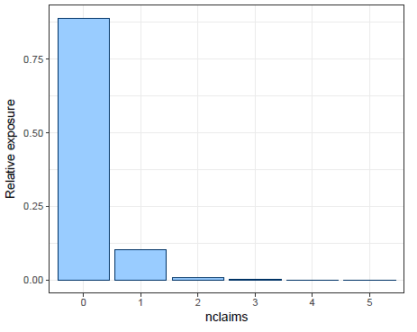
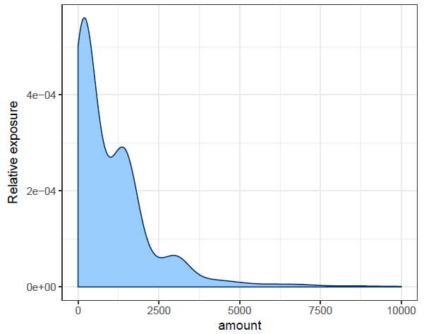
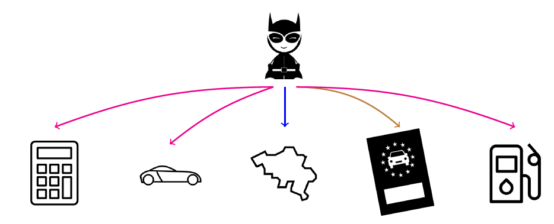
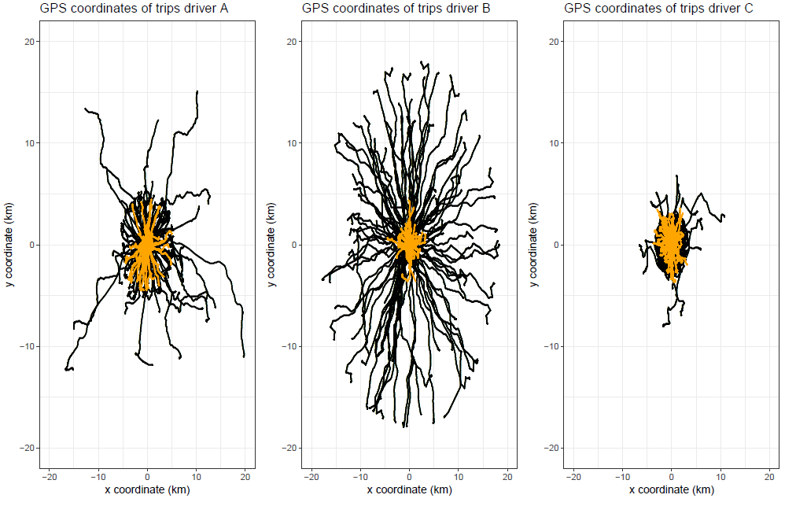
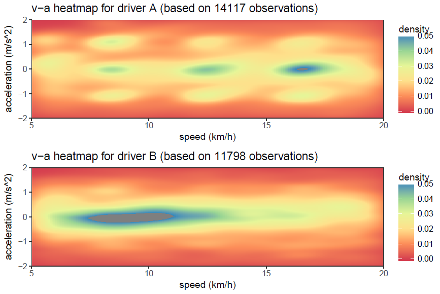
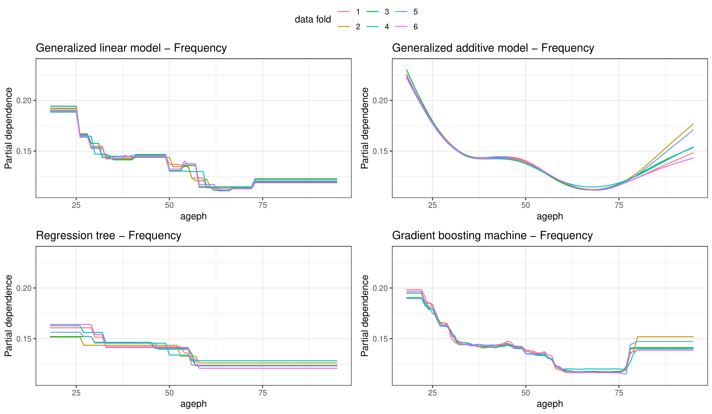
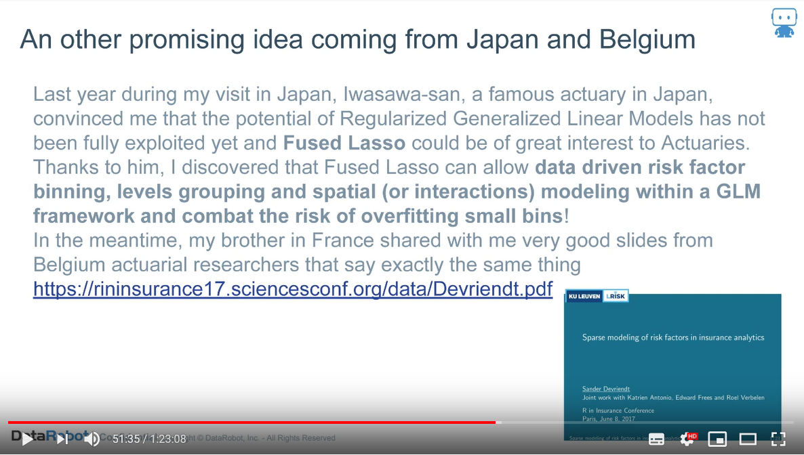

```{r setup, include=FALSE}
options(htmltools.dir.version = FALSE)
library(knitr)
knitr::opts_chunk$set(warning = FALSE, message = FALSE)
# options(knitr.table.format = "html")
library(tidyverse)
library(babynames)
library(fontawesome) # from github: https://github.com/rstudio/fontawesome
library(DiagrammeR)
library(emo) # from github: https://github.com/hadley/emo
library(gt) # from github: https://github.com/rstudio/gt
```

layout: true
  
<div class="my-footer"><span>katrienantonio.github.io</span></div>

<!-- this adds the link footer to all slides, depends on my-footer class in css-->

---
name: my-title-sheet
class: left, middle, inverse

# Boosting insights in insurance tariff plans with data science methods

### .fancy[Data Science Leuven, Meetup]

.moderate[Katrien Antonio | LRisk - KU Leuven | `r Sys.Date()`]

<!-- this ends up being the title slide since seal = FALSE-->

---

name: find-me-two-column-alternative
class: right, middle
background-image: url("img/Katrien-A'dam-Leuven.png")
background-size: 65% 
background-position: left

# Find me at...

[`r fa(name = "twitter")` @katrienantonio](http://twitter.com/katrienantonio)

[`r fa(name = "github")` @katrienantonio](http://github.com/katrienantonio)

[`r fa(name = "link")` katrienantonio.github.io](https://katrienantonio.github.io) 

[`r fa(name = "paper-plane")` katrien.antonio@kuleuven.be](mailto:katrien.antonio@kuleuven.be)

---

name: four-important-principles
class: middle, inverse

# Four important principles

--

### .small[[Inverted](#inverted-production-title-sheet) production cycle.] 

--

### .small[The contributions of the many to cover the [misfortunes of the few](#loss-functions-title-sheet).]

--

### .small[Segmentation or [risk classification](#risk-classification-title-sheet).]

--

### .small[[Highly regulated](#regulated-title-sheet) business.]

---

name: inverted-production-title-sheet
class: middle, inverse, center

# .fancy[.blueinline[Inverted] production cycle]

---

name: inverted-production
class: middle, inverse

### Data driven business ~ estimation and prediction matter!

--

.pull-left[

### .blue[Pricing]

- total cost of a contract only known ex post

- but, premium paid a start of the contract!

]

--

.pull-right[

### .blue[Reserving]

- future development of claims?

- how much capital to hold?

]
---

name: loss-functions-title-sheet
class: middle, inverse, center

# .fancy[Misfortunes of the .orangeinline[few]]

## .fancy[covered by contributions of the .orangeinline[many]]


---

name: loss-functions
class: inverse, middle

.pull-left[
## .fancy[.center[.large[.orangeinline[frequency]]]]
.center[
```{r out.width = '50%', echo=FALSE}

```
]

- number of (insured) events that occurred

- low frequency, very often zero!

]

--

.pull-right[
## .fancy[.center[.large[.orangeinline[severity]]]]
.center[
```{r out.width = '50%', echo=FALSE}

```
]

- only contracts with frequency > 0

- potentially high impact, (heavy) right tail

]

--

.footnote[
Figures from Henckaerts, Antonio et al. (2018). [A data driven binning strategy for the construction of insurance tariff classes](https://katrienantonio.github.io/projects/2019/06/13/machine-learning/#data-driven)
]

---

name: loss-functions-two
class: middle, inverse

# Contributions of the .orangeinline[**many**] 

### .left[.small[.orangeinline[E](frequency) x .orangeinline[E](severity)]]  

--

# Use suitable .orangeinline[**loss functions**], e.g. 

### .left[.small[Poisson (for frequency) and gamma (for severity)]]

--

.footnote[
Henckaerts, Côté, Antonio et al. (2019). [Boosting insights in insurance tariff plans with tree-based machine learning methods](https://katrienantonio.github.io/projects/2019/06/13/machine-learning/#tree-based-pricing)
]

---

name: loss-functions-three
class: inverse, left, bottom
background-image: url("img/github_roel_h.png")
background-size: 85% 
background-position: center

.footnote[
Suitable loss functions for frequency and severity tree-based modelling
<br> <br>
Henckaerts, Côté, Antonio et al. (2019). [Boosting insights in insurance tariff plans with tree-based machine learning methods](https://katrienantonio.github.io/projects/2019/06/13/machine-learning/#tree-based-pricing)
]

---

name: risk-classification-title-sheet
class: middle, inverse, center

# .fancy[.acidinline[Risk classification]]

---

name: risk-classification
class: left, top

## Multiple types of features ~ classics

.center[
```{r out.width = '75%', echo=FALSE}

```
]

<br> <br> <br>

.footnote[
Henckaerts, Antonio et al. (2018). [A data driven binning strategy for the construction of insurance tariff classes](https://katrienantonio.github.io/projects/2019/06/13/machine-learning/#data-driven)

Devriendt, Antonio et al. (2018). [Sparse regression with multi-type regularized feature modeling](https://katrienantonio.github.io/projects/2019/06/13/machine-learning/#SMuRF)

Henckaerts, Côté, Antonio et al. (2019). [Boosting insights in insurance tariff plans with tree-based machine learning methods](https://katrienantonio.github.io/projects/2019/06/13/machine-learning/#tree-based-pricing)
]

---

name: risk-classification-2
class: left, bottom, inverse

## Multiple types of features ~ new stuff

.pull-left[
.center[
```{r out.width = '45%', echo=FALSE, fig.cap="James B."}

```

```{r out.width = '45%', echo=FALSE, fig.cap="Eugene"}
knitr::include_graphics("img/eugene.jpg")
```
]
]

.pull-right[

.large[.acidinline[**James B.**] drives .acidinline[100 000 km] <br> with road type composition <br> .acidinline[(0.15, 0.15, 0.5, 0.2)]. ]

<br>

.large[.acidinline[**Eugene**] drives .acidinline[1 000 km] <br> with road type composition <br> .acidinline[(0.5, 0.3, 0.2, 0)].
]
]

<br> <br> <br>

.footnote[
Verbelen, Antonio et al. (2018). [Unravelling the predictive power of telematics data in car insurance pricing](https://katrienantonio.github.io/projects/2019/02/11/telematics/)
]
---

name: risk-classification-3
class: left, top, inverse

## Multiple types of features ~ new stuff

.pull-left[
```{r out.width = '150%', echo=FALSE}

```
]
.pull-right[
```{r out.width = '150%', echo=FALSE}

```
]

Feature engineering matters!

Pictures based on the work of prof. Mario Wüthrich (ETH) and data from the AXA Kaggle competition.

---

name: regulated-title-sheet
class: middle, inverse, center

# .fancy[Highly .redinline[regulated] business]

---

name: regulated-1
class: middle, inverse

## Interpretability matters

.pull-left[
```{r out.width = '150%', echo=FALSE, include=TRUE, auto_pdf=TRUE}

```
]
.pull-right[

<br>

PDPs, ICEs, variable importance plots, ...

But, .red[GLMs] are still preferred tool, with

$$\text{E}[Y] = \exp{(\textbf{x}^{'}\cdot \boldsymbol{\beta})},$$

and suitable loss distributions. 

]

.footnote[Figure from Henckaerts, Côté, Antonio et al. (2019). [Boosting insights in insurance tariff plans with tree-based machine learning methods](https://katrienantonio.github.io/projects/2019/06/13/machine-learning/#tree-based-pricing)]

---

name: regulated-2
class: bottom, inverse

## Construction of the GLMs

.pull-left[
.center[
```{r out.width = '85%', echo=FALSE}

```

```{r out.width = '85%', echo=FALSE}

```
]
]

.pull-right[

<br> <br>

.red[GLMs] with .red[regularization]

lasso-type penalties

$$-\log{\ \mathcal{L}(\beta_0,\ \boldsymbol{\beta})} + \lambda \sum_{j=1}^J g_j(\boldsymbol{\beta}_j)$$
$\texttt{smurf}$ package for R

.footnote[Devriendt, Antonio et al. (2018). [Sparse regression with multi-type regularized feature modeling](https://katrienantonio.github.io/projects/2019/06/13/machine-learning/#SMuRF)]

]

---

### Thanks to

.pull-left[
.center[
```{r out.width = '60%', echo=FALSE}

```

```{r out.width = '60%', echo=FALSE}

```
]
]

.pull-right[
.center[

<br>

```{r out.width = '85%', echo=FALSE}

```

<br> <br> 

```{r out.width = '85%', echo=FALSE}

```
]
]

---

class: center, middle, inverse

# Thanks!

.bitlarge[Slides created with the R package [xaringan](https://github.com/yihui/xaringan), inspired by the work of [Alison Hill](https://alison.rbind.io/).]

